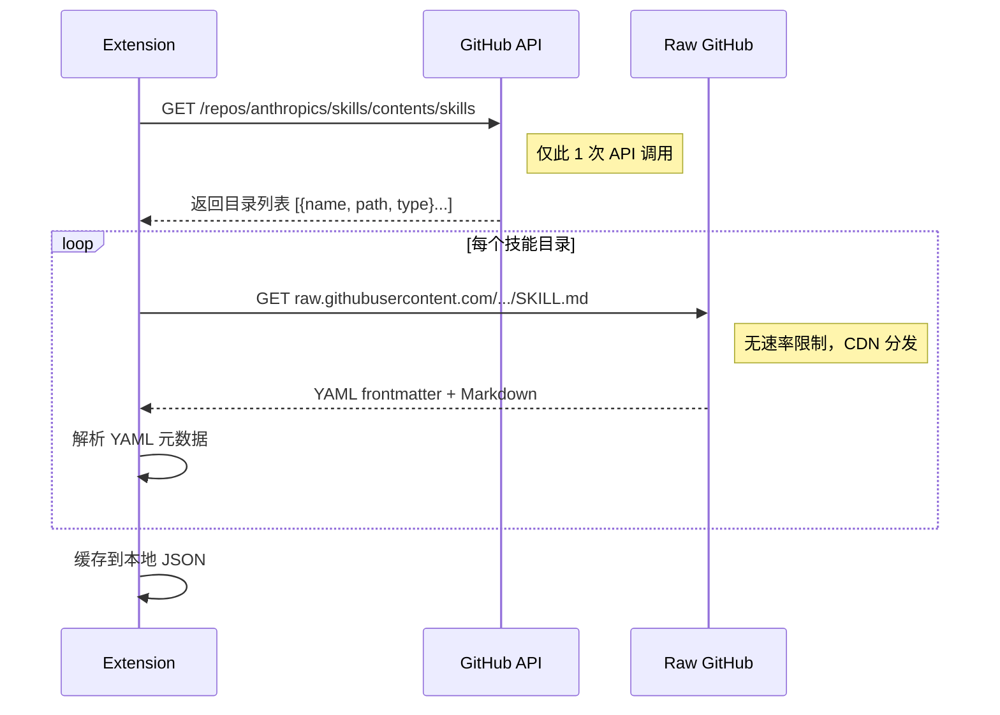

# Claude 官方技能源 (`anthropics/skills`) 集成方案

本方案旨在为 Antigravity 技能市场引入 Claude 官方提供的 **Agent Skills** 生态。

## 1. 核心目标

- **动态解析**: 实时从 [anthropics/skills](https://github.com/anthropics/skills) 官方仓库拉取技能列表
- **元数据适配**: 解析 `SKILL.md` 中的 YAML 前置数据（`name`, `description`, `license`）
- **一键部署**: 支持将远程技能目录完整下载到本地 `skillsPath`

---

## 2. 仓库结构分析 ✅ 已验证

```
anthropics/skills/
├── skills/                    # 所有技能平铺存放
│   ├── algorithmic-art/
│   │   └── SKILL.md
│   ├── brand-guidelines/
│   ├── canvas-design/
│   ├── doc-coauthoring/
│   ├── docx/
│   ├── theme-factory/
│   ├── web-artifacts-builder/
│   └── ...                    # 约 20+ 技能
├── template/                  # 标准模板
│   └── SKILL.md
├── spec/                      # 规范文档
└── README.md
```

### SKILL.md 标准格式

```yaml
---
name: algorithmic-art
description: Creating algorithmic art using p5.js with seeded randomness...
license: Complete terms in LICENSE.txt # 可选字段
---
[正文 Markdown 内容...]
```

---

## 3. 技术实现

### 3.1 数据模型

```typescript
interface ClaudeSkill {
  id: string; // GitHub 路径名 (如 'algorithmic-art')
  name: string; // 映射自 SKILL.md 的 name
  description: string; // 映射自 SKILL.md 的 description
  license?: string; // 可选许可证信息
  rawUrl: string; // SKILL.md 的 raw 链接
  repoLink: string; // GitHub 页面链接
}
```

> [!NOTE]
> 仓库内无分类子目录，所有技能平铺于 `skills/`。分类可通过关键词匹配实现，或暂不分类。

### 3.2 数据获取流程（优先使用 Raw URL ✅）

> [!TIP] > **策略核心**：仅用 GitHub API 获取目录列表（1 次调用），所有文件内容通过 `raw.githubusercontent.com` 获取，**完全绕过 API 速率限制**。



**Raw URL 构造规则**：

```typescript
const rawUrl = `https://raw.githubusercontent.com/anthropics/skills/main/skills/${skillId}/SKILL.md`;
```

### 3.3 安装流程

1. **目录创建**: 在 `skillsPath` 下创建同名目录
2. **文件下载**:
   - `SKILL.md`（必选）
   - `scripts/`、`resources/`、`examples/` 等子目录（递归下载）
3. **状态更新**: 标记为"已安装"，写入本地索引

### 3.4 缓存策略

| 策略               | 说明                               |
| ------------------ | ---------------------------------- |
| **本地 JSON 缓存** | 存储技能列表，避免重复请求         |
| **TTL 过期**       | 缓存有效期 1 小时，过期后静默刷新  |
| **ETag 校验**      | 利用 GitHub API 的 ETag 头检测变更 |

---

## 4. UI 展现

- **官方标识**: 技能卡片右上角显示 ✓ 认证徽章
- **详情页**: 展示 GitHub 源码链接、许可证信息
- **分类筛选**: 暂定"全部"单一分类，后续可扩展

---

## 5. 风险与应对

| 风险                             | 应对方案                       |
| -------------------------------- | ------------------------------ |
| GitHub API 速率限制 (60 次/小时) | 启用缓存 + 提示用户配置 Token  |
| 网络超时                         | 设置 10s 超时 + 重试机制       |
| SKILL.md 格式异常                | try-catch 容错，跳过解析失败项 |

---

## 6. 验证计划

### 自动化测试

- [ ] `fetchOfficialSkills()`: 验证能否正确获取目录列表
- [ ] `parseSkillMetadata()`: 验证 YAML 解析正确性
- [ ] `downloadSkill()`: 验证本地文件写入完整性

### 手动验证

- [ ] 侧边栏切换到"官方库"，检查列表渲染
- [ ] 点击安装 `algorithmic-art`，验证本地目录生成
- [ ] 断网测试，验证缓存回退机制

---

> [!IMPORTANT]
> 该文档已通过 API 可行性验证。确认后可转入实现阶段。
